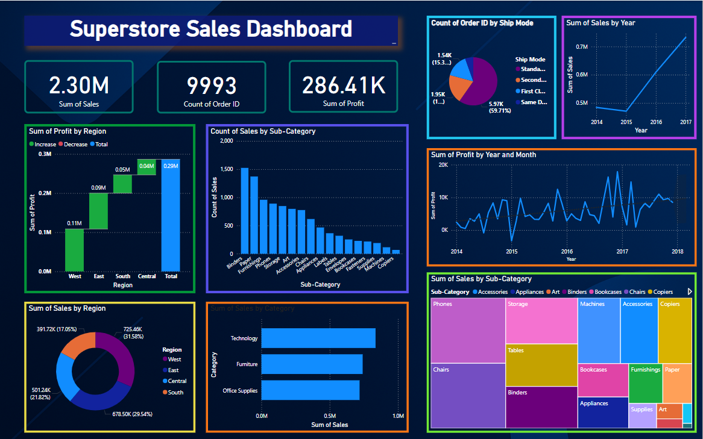

# 🛒 Retail Sales Analysis

A complete exploratory data analysis (EDA) and forecasting project focused on retail sales data. The project identifies key sales patterns, seasonal trends, and builds predictive models to forecast future demand at the item-store level.

---

## 📊 Project Overview

This project analyzes transactional sales data to:

- Understand sales distribution across items and stores  
- Identify temporal trends and seasonality  
- Forecast future sales using machine learning and time series techniques  
- Help businesses optimize inventory and promotions

---

## 📈 Dashboards



---

## 📁 Data Description

The dataset typically contains:

| Column Name | Description                      |
|-------------|----------------------------------|
| `date`      | Date of transaction              |
| `store_id`  | Unique ID for each store         |
| `item_id`   | Unique ID for each product       |
| `sales`     | Number of items sold             |

> **Note:**  
> The actual dataset used is `Superstore.csv` and `cleaned_superstore.csv`.  
> Key columns include:  
> `Order ID`, `Order Date`, `Ship Date`, `Ship Mode`, `Customer ID`, `Customer Name`, `Segment`, `Country`, `City`, `State`, `Postal Code`, `Region`, `Product ID`, `Category`, `Sub-Category`, `Product Name`, `Sales`, `Quantity`, `Discount`, `Profit`.

---

## 🛠 Environment Setup

To get started, clone the repository and install the required dependencies.

### 1. Clone the repository

```bash
git clone https://github.com/Madhuarvind/Retail_sales_analysis.git
cd Retail_sales_analysis
```

### 2. Create a virtual environment and activate it

```bash
# On Windows
python -m venv venv
.\venv\Scripts\activate

# On macOS/Linux
python3 -m venv venv
source venv/bin/activate
```

### 3. Install dependencies

```bash
pip install -r requirements.txt
```

---

## 🚀 Usage

- To run the SQL queries:

```bash
python run_all_queries.py
```

- If `app.py` is a web application (e.g., built with Flask or Dash), run it with:

```bash
python app.py
```

> *Further instructions depend on the nature and framework of `app.py`.*

---

## 🧾 Data

- Original dataset: `dataset/Superstore.csv`
- Cleaned dataset used for analysis: `cleaned_dataset/cleaned_superstore.csv`

---

## 📂 Analysis

SQL queries used for analysis are stored in:

```
sql/retail_analysis.sql
```

---

## 📊 Visualization

Main dashboard visualization:

```
visualization/retail_sales_analysis.png
```

---

## 🤝 Contributing

Pull requests are welcome. For major changes, please open an issue first to discuss what you'd like to change.
